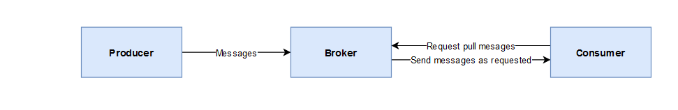
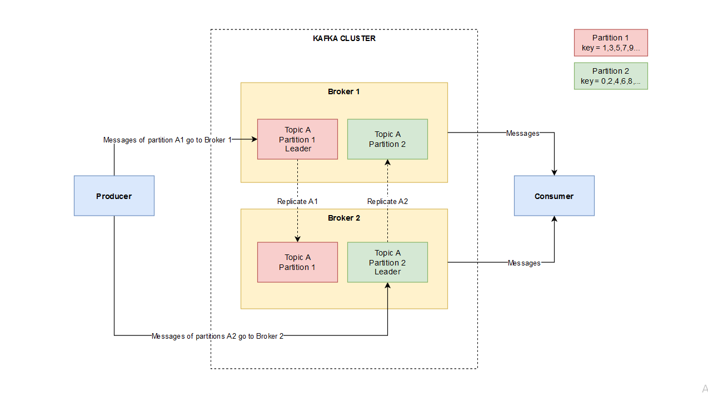

# Overview of a Kafka cluster 

### Main concepts
- **Topic** - can be understood as **table** in databases
- **Producer** - produces messages to Kafka.
- **Broker** - stores messages to service fetch requests from consumers. Each Broker is a single Kafka server. On receiving messages from Producer, Broker assigns offsets to it (which is an increment integer number on each message: 1, 2, 3, ...) then write messages to disk for further usage. 
- **Consumer** - subscribe to a topic then fetch messages. 

### Kafka cluster with replication

### Simplified workflow
1, When consumer send messages to kafka, they will be partitioned based on **keys**. For example, messages having key ended with 1, 3, 5, 7, 9 go to Broker 1 and messages having key ended with 0, 2, 4, 6, 8 go to Broker 2.
2, Each partition has a Broker as leader, messages of a partition will be sent to partition leader first, then they can be replicated into other brokers to increase availability and durability. 
3, When Consumer want to read messages from a cluster, it can read messages from any Broker which has that partition available.