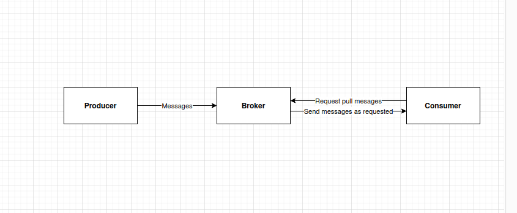

In this blog I will introduce you about a Kafka cluster

# 1. Simplified overview of Kafka's components

a Kafka cluster contains 3 main components
- **Producer** - produces messages to Kafka.
- **Broker** - stores messages to service fetch requests from consumers. Each Broker is a single Kafka server. On receiving messages from Producer, Broker assigns offsets to it (which is an increment integer number on each message: 1, 2, 3, ...) then write messages to disk. 
- **Consumer** - subscribe to a topic and create fetch requests to get messages for further consume.

# 2. Kafka cluster with replication

